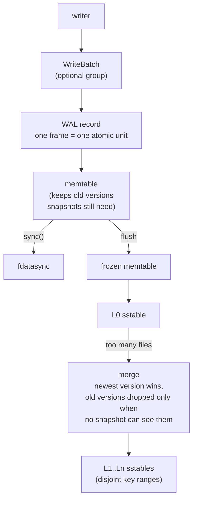
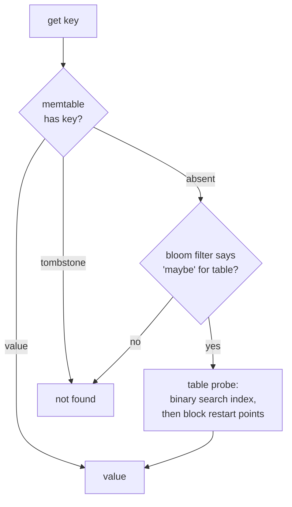

# Kiban

An embedded LSM-tree storage engine in Rust. Single node. Zero
dependencies. Byte keys, byte values, sorted.

You put data in. It hits a log on disk first. Then memory. Then sorted
files. Reads check the newest place first and walk down. Deletes write
a marker, not a hole — the marker and the old value die together later,
during compaction.

That is the whole idea. The rest is making it honest.

## Status

Not a toy anymore. Not a product yet.

**Built and tested:**

- Write-ahead log with explicit durability: `put` reaches the kernel,
  `sync` reaches the disk. Nothing claims durability before sync
  returns success.
- SSTables: prefix-compressed blocks with restart points, per-block
  CRC-32, bloom filters (10 bits/key), fixed footer with magic.
- Leveled compaction: L0 merges whole, deeper levels stay disjoint,
  output split at key boundaries.
- Snapshots: a snapshot pins the sequence counter and the file set.
  A scan through an old snapshot sees the old world even after every
  key has been overwritten, deleted, and compacted away.
- Crash testing done properly:
  - deterministic fault injection at every syscall boundary
    (fail the Nth operation, exhaustively, for all N)
  - single-fault AND pairwise-fault sweeps
  - a simulated volatile device: writes land in an overlay that only
    sync commits; power loss discards exactly the unsynced bytes.
    After every crash point, recovered state must EQUAL the last
    acknowledged state. It does.
- Engine poisoning: after a WAL sync failure or a commit ambiguity,
  the engine refuses all mutations until reopen. Reads stay available.
- Multi-version memtable: superseded versions live while snapshots
  can see them.
- `WriteBatch`: many mutations, one WAL record, one contiguous
  sequence interval. Recovery applies all of it or none of it.
- Block cache + lazy table loading: opening a big database touches
  footers and indexes only, not every byte.

**Not built yet:**

- Background flush/compaction threads (compaction runs inline today)
- File-descriptor cache (tables hold fds while open)
- Compression (the format reserves the slot)
- Range deletes, reverse iterators, transactions
- Metrics

## How data flows



## How reads work



Newest source wins. A tombstone stops the search — that is what makes
deletes safe while old values still sit in older files. Sequence numbers
order everything; log order and sequence order are the same thing.

## Why it is built this way

Every mechanism exists because something on disk or in the kernel would
otherwise eat your data:

- `write()` does not mean durable. Only `fsync` does. And `fsync` can
  fail *after* the kernel already threw the pages away — so retrying
  is not recovery, it is lying.
- A rename is not durable either. The directory entry needs its own
  fsync. This is why publishing a file means: write temp, fsync, rename,
  fsync the directory. Every time.
- Bytes on disk lie. Bit rot, torn writes, bad firmware. Every block,
  record, and manifest carries a CRC, and readers validate before they
  trust. Corruption is reported, never silently repaired.
- A crash mid-append leaves a torn tail. That is normal. Recovery
  replays the good prefix and truncates the garbage. But corruption —
  bytes that fail checksum in ways a crash cannot explain — stops the
  engine. Loudly.

The full reasoning lives in `docs/design/`. Each document records the
decision, the alternatives rejected, and what evidence would reopen it.

## The rules

1. Acknowledged durability never gets weaker than documented.
2. A crash cannot cause sequence-number reuse.
3. The MANIFEST is the authority. Files it does not name are garbage.
4. Internal ordering: user key ASC, sequence DESC.
5. A snapshot sees the newest version at or before its sequence number.
   Newer invisible versions never hide older visible ones.
6. Tombstones disappear only when nothing older can resurrect.
7. Point reads and scans must always agree.

These are enforced by tests, including fault sweeps that break every
syscall in the pipeline, one at a time and in pairs.

## Building

```bash
cargo test          # 116 tests
cargo clippy --all-targets -- -D warnings
cargo fmt --check
```

Zero dependencies. Linux-only so far (POSIX fsync semantics are the
contract).

## What "done" means here

Not feature count. The bar: every invariant explainable from first
principles, every crash point swept, every durability claim matching
what the hardware actually did. See `docs/design/principles.md`.
