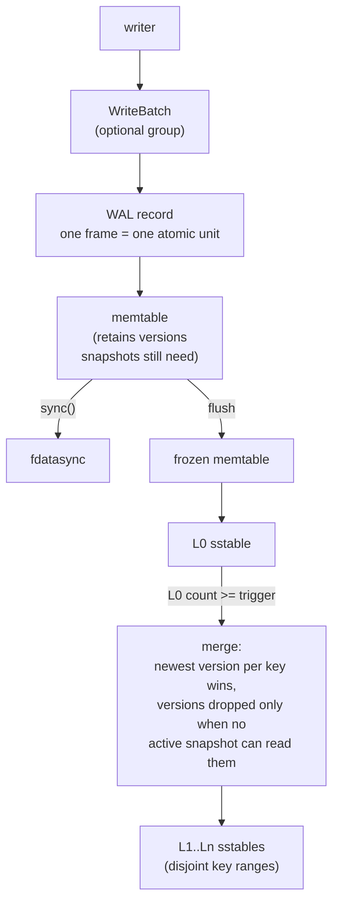
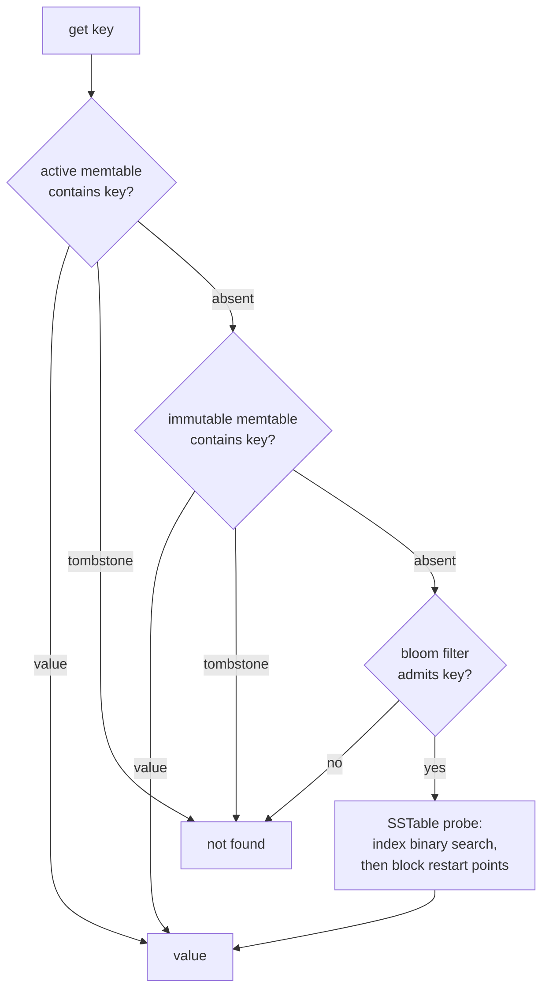

# Kiban DB

An embedded LSM-tree storage engine in Rust. Single node. Zero
dependencies. Byte keys, byte values, sorted.

Writes go to a write-ahead log, then to an in-memory memtable. Flushes
produce sorted SSTables. Compaction merges SSTables and drops versions
that no active snapshot can observe. Reads check sources from newest
to oldest; sequence numbers order everything.

## Status

Implemented:

- Write-ahead log with two-phase durability: `put` reaches the kernel,
  `sync` reaches the device. Durability is claimed only after sync
  returns success.
- SSTables: prefix-compressed blocks with restart points, per-block
  CRC-32, bloom filters (10 bits/key), fixed footer with magic number.
- Leveled compaction: L0 compacts as a whole, L1+ maintain disjoint
  key ranges, outputs split at key boundaries.
- Snapshots: pin a sequence number and the file set at capture time.
  Reads through a snapshot are unaffected by later writes and
  compactions.
- Deterministic fault injection at syscall boundaries: single-fault and
  pairwise sweeps over pipeline operations, plus a simulated volatile
  device where power loss discards exactly the unsynced bytes. After
  every tested crash point, recovered state must equal the last
  acknowledged state.
- Engine poisoning: WAL sync failures and commit ambiguities set a
  fatal state that refuses mutations until reopen. Reads remain
  available.
- Multi-version memtable: superseded entries are retained while an
  active snapshot can observe them.
- `WriteBatch`: multiple mutations committed as one WAL record with a
  contiguous sequence interval. Recovery applies all operations or none.
- Block cache, lazy table loading, and a bounded shared table-file cache:
  opening touches footers and indexes only.
- `SharedKiban::stats()`: a cheap, observation-only snapshot — memtable
  size, per-level table counts and bytes, snapshot/obsolete-file
  counts, and raw block-cache/file-cache/compaction/flush counters. No
  disk I/O, no derived verdicts.
- Background flush and compaction: the active memtable freezes on a
  size threshold and hands writers a fresh memtable and WAL
  immediately; the frozen memtable and compaction both build off the
  foreground lock, on one shared maintenance worker (flush first),
  paced to protect foreground read latency (see Performance).
- Gate-free reads: `SharedKiban::get` never acquires the engine-wide
  write gate, at any point. A published `ReadView` (shadow memtable +
  frozen memtable + version, swapped atomically at each structural
  commit) lets readers run fully decoupled from writers/compaction.
- Dedicated cache-bypassing bulk reader for compaction: compaction
  reads input tables through an owned file handle with large
  sequential read-ahead, never touching the foreground block cache or
  the shared table-file cache.
- Evidence-scored compaction scheduler (opt-in): scores L0 and
  per-level candidates by urgency/stall-risk/overlap-cost instead of a
  fixed drain order, plus key-contiguous batching of a level's oldest
  tables into one job. Off by default — see Performance for the
  throughput/tail-latency tradeoff.
- Opt-in mmap hybrid read path: maps low-level (hot) SSTables whole
  instead of leasing through the block/file cache; cold levels keep
  the pread path. Off by default.
- Read/write amplification counters (`KibanStats::read_amp`,
  `MaintenanceStats`): per-get resolution point and physical
  flush/compaction bytes, for evaluating scheduler and I/O-path
  changes against evidence rather than intuition.

Not implemented:

- Compression (format reserves a type byte)
- Range deletes, reverse iterators, transactions

## Architecture





Reads consult sources newest-first. A tombstone terminates the search:
older values may still exist in older files until compaction removes
them. Sequence numbers define recency; log order equals sequence order.

## Concurrency

One primitive, `ShardedRwLock<T>`, does both jobs in the engine:

- As the **engine-wide gate**: 8 independent shards instead of one
  lock. A reader takes a read lock on a single shard (round-robin per
  thread), so readers on different shards never contend with each
  other at all. A writer takes a serial lock plus every shard's write
  lock, in ascending order — real exclusivity, no deadlock by
  construction. A `writer_pending` flag lets an approaching reader
  bail out early instead of piling up behind a writer; it's a liveness
  hint only, never load-bearing for safety.
- As the **published read view**: the same primitive, reused at a
  smaller scope, holds a shadow memtable and a `ReadView` (memtable +
  frozen memtable + version, swapped atomically at each structural
  commit). `SharedKiban::get` reads through this and never touches the
  engine-wide gate — writers and compactors no longer block readers at
  all.

Every acquire/release interleaving of the protocol is checked with
[loom](https://github.com/tokio-rs/loom) (`cargo test --features loom`),
bounded to a preemption depth of 3 to keep the search tractable — loom's
own documented answer for exhaustive search that doesn't finish, since
almost every real concurrency bug is reachable within a few context
switches. The bound isn't vacuous: a real guard-lifetime bug found
during development (`if gate.write().is_some() { .. }`, which drops
the guard before the body runs) is still caught by the model in well
under a second.

## Correctness rules

1. Acknowledged durability matches the documented contract exactly.
2. A crash cannot cause sequence-number reuse.
3. The MANIFEST is authoritative. Files it does not name are deleted.
4. Internal ordering: user key ASC, sequence DESC.
5. A snapshot reads the newest version whose sequence is at or below
   its own.
6. Newer invisible versions never hide older visible ones.
7. Tombstones are dropped only when no older value can be resurrected.
8. Point reads and scans agree.

These rules are enforced by tests, including exhaustive fault sweeps
over pipeline syscalls (single faults and pairs) and simulated
power-loss runs asserting exact equality between recovered state and
the last acknowledged state.

## Failure model

- `write()` reaches the kernel page cache, not the device.
- `fsync` reaching the device is the durability boundary.
- A rename requires an fsync of the containing directory.
- Storage media can corrupt bytes. Every block, record, and manifest
  carries a CRC. Readers validate before use; corruption is reported
  as an error and never repaired in place.
- A crash during append leaves a torn tail. Recovery truncates it.
- `fsync` can fail after the kernel discarded dirty pages. Kiban treats
  such failures as fatal: the engine enters a poisoned state and
  refuses further mutations until reopen.

Kiban's design and research notes are private; this README is the
public design overview.

## Performance

Local dev-workstation numbers (`cargo bench --bench basic` /
`--bench steady_state`), treat as relative, not absolute.

**Gate-free reads** — same data, hot in Kiban's own block cache before
and after, so this isolates the gate's own cost:

| workload            | threads | before          | after            |
|----------------------|--------|-----------------|------------------|
| 90R/10W              | 16     | 468K gets/s, p99 368us  | 4.22M gets/s, p99 7.48us (9.0x, 49x)  |
| 95R/5W               | 32     | 280K gets/s, p99 647us  | 4.91M gets/s, p99 24.8us (17.5x, 26x) |
| 99R/1W               | 32     | 1.91M gets/s, p99 37us  | 4.59M gets/s, p99 18.5us (2.4x, 2x)   |
| 100R/0W              | 32     | 5.10M gets/s, p99 13us  | 8.58M gets/s, p99 4.42us (1.7x, 2.9x) |

**Compaction isolation** — dedicated sequential-read-ahead reader for
compaction, bypassing the foreground block/file cache (tiny-buffer
stress workload, concurrent foreground reader on a hot keyspace):

| metric              | before   | after     |
|----------------------|---------|-----------|
| wall clock, 40K writes | 948ms  | ~470ms (2x)   |
| GET p99               | 224us  | ~110-120us (-47%) |
| compaction throughput | ~8.85 MB/s | ~18 MB/s (2x) |

**Maintenance pacing** — best-effort sleep between background jobs
while L0 has headroom, same stress workload:

| metric        | before        | after                |
|----------------|--------------|------------------------|
| GET p99        | ~122us        | ~50-60us (2-2.4x)      |
| GET throughput | ~71K ops/s    | ~210-315K ops/s (3-4.5x) |
| PUT p99        | ~234us        | ~120-145us (better)    |

**Compaction scheduler** (opt-in `Scored` + batching, vs. default
`FixedPriority`) — long-run steady-state torture bench, reproduced
across two runs and two workload shapes:

- write amplification: 2.3-4.3x lower (24-62x down to 10-14x)
- sustained throughput: 2-6x higher, PUT p99 comparable-to-better
- tradeoff: on a monotonically-increasing-key workload, wider/more
  variable L0 costs GET p99 about 45% — a fatter tail, not a change in
  average tables probed per get. `FixedPriority` keeps L0 small and
  predictable by construction, which is why it stays the default;
  `Scored` is recommended only for write-throughput/write-amp-sensitive
  deployments that can tolerate a wider L0 tail.

**mmap hybrid** (opt-in, hot/low levels only) — modest and consistent,
smaller than a mmap-vs-pread microbenchmark suggests because real
working sets partly fit the OS page cache either way:

- ~5-10% throughput improvement across 1-32 threads, no observed tail
  regression, on a cache-miss-heavy workload.

## Building

```bash
cargo test
cargo clippy --all-targets --all-features -- -D warnings
cargo fmt --check

# exhaustive concurrency model of the sharded gate protocol
cargo test --features loom -- --test-threads=1 loom_

# benchmarks
cargo bench --bench basic
cargo bench --bench steady_state
```

Zero non-dev dependencies (`loom` is test-only, behind a feature
flag). Linux-only (POSIX fsync semantics are part of the contract).
