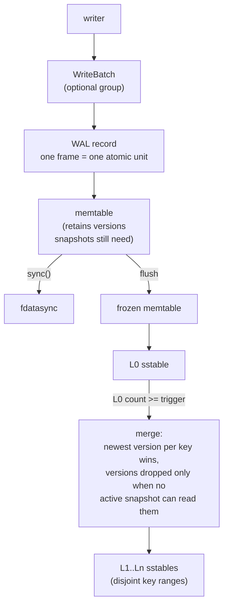
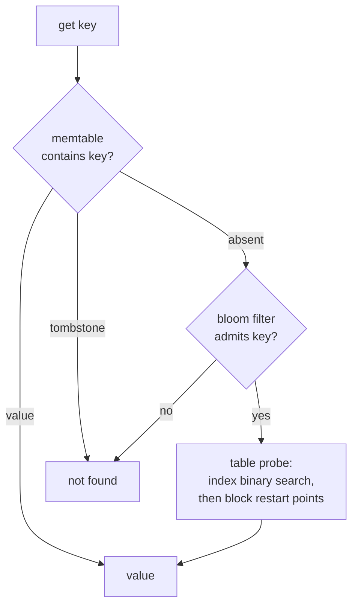

# Kiban

An embedded LSM-tree storage engine in Rust. Single node. Zero
dependencies. Byte keys, byte values, sorted.

Writes go to a write-ahead log, then to an in-memory memtable. Flushes
produce sorted SSTables. Compaction merges SSTables and drops versions
that no active snapshot can observe. Reads check sources from newest
to oldest; sequence numbers order everything.

## Status

Implemented:

- Write-ahead log with two-phase durability: `put` reaches the kernel,
  `sync` reaches the device. Durability is claimed only after sync
  returns success.
- SSTables: prefix-compressed blocks with restart points, per-block
  CRC-32, bloom filters (10 bits/key), fixed footer with magic number.
- Leveled compaction: L0 compacts as a whole, L1+ maintain disjoint
  key ranges, outputs split at key boundaries.
- Snapshots: pin a sequence number and the file set at capture time.
  Reads through a snapshot are unaffected by later writes and
  compactions.
- Deterministic fault injection at syscall boundaries: single-fault and
  pairwise sweeps over pipeline operations, plus a simulated volatile
  device where power loss discards exactly the unsynced bytes. After
  every tested crash point, recovered state must equal the last
  acknowledged state.
- Engine poisoning: WAL sync failures and commit ambiguities set a
  fatal state that refuses mutations until reopen. Reads remain
  available.
- Multi-version memtable: superseded entries are retained while an
  active snapshot can observe them.
- `WriteBatch`: multiple mutations committed as one WAL record with a
  contiguous sequence interval. Recovery applies all operations or none.
- Block cache and lazy table loading: open touches footers and indexes
  only.
- `SharedKiban::stats()`: a cheap, observation-only snapshot — memtable
  size, per-level table counts and bytes, snapshot/obsolete-file
  counts, and raw block-cache/file-cache/compaction/flush counters. No
  disk I/O, no derived verdicts.
- Background flush and compaction: the active memtable freezes on a
  size threshold and hands writers a fresh memtable and WAL
  immediately; the frozen memtable and compaction both build off the
  foreground lock, on one shared maintenance worker (flush first).

Not implemented:

- File-descriptor cache for table files
- Compression (format reserves a type byte)
- Range deletes, reverse iterators, transactions

## Architecture





Reads consult sources newest-first. A tombstone terminates the search:
older values may still exist in older files until compaction removes
them. Sequence numbers define recency; log order equals sequence order.

## Correctness rules

1. Acknowledged durability matches the documented contract exactly.
2. A crash cannot cause sequence-number reuse.
3. The MANIFEST is authoritative. Files it does not name are deleted.
4. Internal ordering: user key ASC, sequence DESC.
5. A snapshot reads the newest version whose sequence is at or below
   its own.
6. Newer invisible versions never hide older visible ones.
7. Tombstones are dropped only when no older value can be resurrected.
8. Point reads and scans agree.

These rules are enforced by tests, including exhaustive fault sweeps
over pipeline syscalls (single faults and pairs) and simulated
power-loss runs asserting exact equality between recovered state and
the last acknowledged state.

## Failure model

- `write()` reaches the kernel page cache, not the device.
- `fsync` reaching the device is the durability boundary.
- A rename requires an fsync of the containing directory.
- Storage media can corrupt bytes. Every block, record, and manifest
  carries a CRC. Readers validate before use; corruption is reported
  as an error and never repaired in place.
- A crash during append leaves a torn tail. Recovery truncates it.
- `fsync` can fail after the kernel discarded dirty pages. Kiban treats
  such failures as fatal: the engine enters a poisoned state and
  refuses further mutations until reopen.

Design documents recording each decision, rejected alternatives, and
reopening conditions live in `docs/design/`.

## Building

```bash
cargo test
cargo clippy --all-targets -- -D warnings
cargo fmt --check
```

Zero dependencies. Linux-only (POSIX fsync semantics are part of the
contract).
